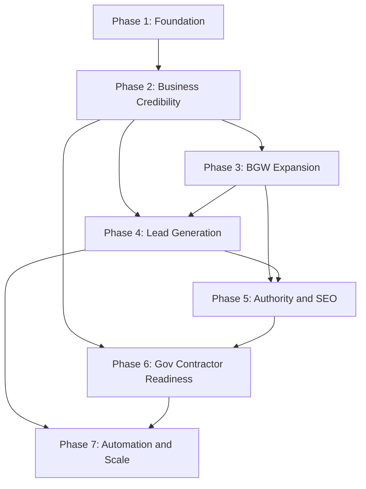

# FTBS + BGW Website — Master Project Roadmap

**Project:** ftbs-website  
**Domain:** [ftbsllc.com](https://ftbsllc.com/)  
**Parent company:** FTBS — Finesse Technology Business Solutions, LLC  
**Division:** BGW Construction Company  
**Document type:** Master roadmap (planning only)  
**Last updated:** June 2026

---

## Primary goals

| Goal | Description |
|---|---|
| **Professional business website** | Credible corporate presence for FTBS as parent brand |
| **Construction division website** | Dedicated BGW Construction narrative, services, and proof of work |
| **Government contractor readiness** | Procurement-ready pages, credentials, NAICS/SAM, downloadable capability materials |
| **Lead generation** | Routed inquiries, dedicated forms, measurable conversion paths |
| **SEO growth** | Indexable content, structured data, content strategy, organic discovery |
| **Future scalability** | Route registry, reusable components, automation-ready architecture |

---

## Phase overview

| Phase | Name | Status (June 2026) | Effort | Business impact |
|---|---|---|---|---|
| 1 | Foundation | **Largely complete** | 3–4 weeks | 9/10 |
| 2 | Business Credibility | **Largely complete** (sample content remains) | 4–5 weeks | 10/10 |
| 3 | BGW Construction Expansion | Not started | 3–4 weeks | 9/10 |
| 4 | Lead Generation System | Partial (general contact + Resend) | 3–4 weeks | 10/10 |
| 5 | Authority & SEO Growth | Not started | 5–8 weeks (ongoing) | 8/10 |
| 6 | Government Contractor Readiness | Not started | 4–5 weeks | 10/10 |
| 7 | Automation & Scale | Not started | 4–6 weeks | 7/10 |

**Total estimated calendar:** 7–9 months to full gov-ready, scalable platform (1 developer + content/legal support).

---

## Master dependency flow

---

# Phase 1 — Foundation

**Business impact score:** **9 / 10** — Without a stable site shell, no credibility or lead work is possible.

## Objectives

- Establish production-ready Next.js App Router architecture
- Deliver core FTBS pages with mobile-first, accessible layout
- Create reusable component library and design system
- Enable basic SEO indexing and social sharing
- Prepare route registry for future phases without rewrites

## Pages

| Route | Status | Purpose |
|---|---|---|
| `/` | Live | Corporate homepage |
| `/about` | Live | Company overview |
| `/services` | Live | Service catalog |
| `/contact` | Live | General inquiry |

## Components

| Category | Components |
|---|---|
| Layout | `SiteHeader`, `Navbar`, `MobileNavigation`, `Footer` |
| UI | `Button`, `Card`, `Badge`, `ContentContainer`, `Section` |
| Marketing | `Hero`, `PageBanner`, `SectionHeader`, `ServicesGrid`, `CTASection` |
| Templates | `MarketingPageTemplate`, `InteriorPageTemplate` |
| Forms | `ContactForm` |
| SEO | `OrganizationJsonLd`, `LocalBusinessJsonLd` |

## SEO requirements

- Per-page `title`, `description`, canonical URL
- Open Graph + Twitter card metadata on core routes
- Dynamic `/sitemap.xml` and `/robots.txt`
- Organization structured data sitewide
- `metadataBase` set to production domain

## Accessibility requirements

- Skip-to-main-content link
- Semantic landmarks (`header`, `nav`, `main`, `footer`)
- Keyboard-accessible mobile menu (Escape to close)
- Visible `:focus-visible` states on interactive elements
- Color contrast meeting WCAG AA on brand palette
- `prefers-reduced-motion` respected in global CSS

## Technical requirements

- Next.js 16 App Router, TypeScript, Tailwind CSS v4
- Central config: `lib/company.ts`, `lib/routes.ts`, `lib/pages.ts`, `lib/navigation.ts`
- Static generation for marketing pages where possible
- ESLint clean; production build passes
- Environment variable pattern documented (`.env.example`)

## Completion criteria

1. All four core pages render on mobile and desktop without layout breaks
2. Navigation, mobile menu, and footer function correctly
3. Contact form validates and displays success/error states
4. `npm run build` and `npm run lint` pass
5. Site deployed to production host with HTTPS
6. Sitemap submitted to Google Search Console
7. Lighthouse: Performance ≥ 90, Accessibility ≥ 95 on homepage

## Dependencies

- None (starting phase)
- Client: company name, address, service descriptions, brand direction

## Estimated effort

| Role | Hours |
|---|---|
| Development | 80–100 |
| Content | 20–30 |
| QA / deploy | 15–20 |
| **Total** | **~3–4 weeks** |

---

# Phase 2 — Business Credibility

**Business impact score:** **10 / 10** — Transforms a starter site into a contract-aware business presence.

## Objectives

- Publish procurement-facing credibility pages
- Present past performance structure (portfolio + case studies)
- Display leadership identity (Paul Gibbs, BGW President)
- Mark sample vs. verified content honestly
- Replace anonymous branding with FTBS/BGW identity placeholders
- Wire contact form to email delivery (Resend)

## Pages

| Route | Status | Purpose |
|---|---|---|
| `/capability-statement` | Live (sample-backed) | Corporate capability statement |
| `/projects` | Live (sample portfolio) | Projects portfolio by track |
| `/case-studies` | Live (3 samples) | Narrative case studies |
| `/case-studies/[slug]` | Live | Case study detail |
| `/testimonials` | Live (sample quotes) | Client testimonials |
| `/certifications` | Live (placeholders) | Credentials and compliance |
| `/company-profile` | Live | Executive overview + download CTA |
| `/legal/privacy` | Planned | Privacy policy |
| `/legal/terms` | Planned | Terms of service |
| `/faq` | Planned | FAQ hub |

## Components

| Component | Purpose |
|---|---|
| `Logo`, `BgwBadge` | Brand identity placeholders |
| `PresidentLetter` | Paul Gibbs formal letter + leadership card |
| `SampleContentNotice` | Sample/demo content disclaimer |
| `ProjectCard`, `ProjectPortfolioSections` | Portfolio display |
| `CaseStudyCardList` | Case study index cards |
| `TestimonialsSection` | Reusable testimonial grid |
| `CertificationGrid` | Credentials and standards layout |
| `CredibilitySubNav` | Sub-navigation across credibility pages |

## SEO requirements

- Unique metadata for all Phase 2 routes
- Dynamic OG/Twitter images per credibility page
- `WebPage`, `ItemList`, and `Review` JSON-LD where appropriate
- Case study URLs included in sitemap
- Internal linking: Home → capability/projects; About → credibility hub
- Leadership name in About and Company Profile copy (E-E-A-T signal)

## Accessibility requirements

- Sample content notices use `role="note"`
- Portfolio filter tabs: `role="tablist"` / `aria-selected` (if filters added)
- Blockquote semantics for president letter and testimonials
- Download CTAs as clear links/buttons with descriptive labels
- Certification status badges not conveyed by color alone (text labels)

## Technical requirements

- Activate Phase 2 routes in `lib/routes.ts`
- Content modules under `lib/content/`, data under `lib/projects.ts`, `lib/case-studies.ts`, etc.
- Resend integration with honeypot spam protection
- Redirects from deprecated `/about/*` paths
- Custom favicon + Apple touch icon
- Phone number in `lib/company.ts`; leadership in `lib/leadership.ts`

## Completion criteria

1. All Phase 2 routes live and in sitemap
2. Paul Gibbs leadership and president letter published on About
3. Capability statement includes gov/commercial readiness section
4. Portfolio organized by construction, technology, and consulting tracks
5. Three case studies with challenge / solution / results / lessons learned
6. Testimonials clearly marked as sample until approved
7. Certifications page publishes **only** verified credentials; placeholders labeled
8. Contact form delivers email in production (Resend env configured)
9. Official logo replaces placeholder when client provides asset
10. Privacy Policy and Terms linked in footer

## Dependencies

- Phase 1 complete and deployed
- Client: Paul Gibbs approved letter, phone, leadership email
- Client: project photos and case study approvals (to replace samples)
- Client: verifiable certification documents
- Legal: privacy and terms copy

## Estimated effort

| Role | Hours |
|---|---|
| Development | 100–120 |
| Content / copy | 40–60 |
| Legal | 10–20 |
| QA | 20–25 |
| **Total** | **~4–5 weeks** |

---

# Phase 3 — BGW Construction Expansion

**Business impact score:** **9 / 10** — Makes BGW a first-class division, not a footnote.

## Objectives

- Launch dedicated BGW Construction division hub
- Publish service vertical pages aligned with president's infrastructure mission
- Visualize BGW project gallery and future development focus
- Prepare division route hierarchy for SEO and navigation
- Connect BGW narrative to FTBS parent brand without duplicating entire site

## Pages

| Route | Status | Purpose |
|---|---|---|
| `/divisions` | Planned | FTBS divisions overview |
| `/divisions/bgw-construction` | Planned | BGW division landing |
| `/divisions/bgw-construction/infrastructure` | Planned | Infrastructure services |
| `/divisions/bgw-construction/commercial` | Planned | Commercial construction |
| `/divisions/bgw-construction/residential` | Planned | Residential / housing |
| `/divisions/bgw-construction/future-development` | Planned | Long-term development vision |
| `/divisions/bgw-construction/projects` | Planned | BGW project gallery |

## Components

| Component | Purpose |
|---|---|
| `DivisionHero` | BGW-branded hero with earth/green tokens |
| `DivisionServiceGrid` | Vertical service cards |
| `ProjectGallery` | Photo grid with lightbox |
| `InfrastructurePillars` | Roads, buildings, housing, public works |
| `PresidentLetter` (reuse) | Featured on BGW hub |
| `BgwBadge` (reuse) | Division labeling sitewide |
| `DivisionCTA` | Partner / inquiry CTAs scoped to BGW |

## SEO requirements

- Division-specific titles: "BGW Construction | Infrastructure Services"
- BGW OG images with division branding
- BreadcrumbList JSON-LD for division hierarchy
- Cross-links from FTBS services ↔ BGW verticals
- Image alt text for all gallery photos (location/type, not client if confidential)
- Target keywords: infrastructure development, commercial construction, housing, public works

## Accessibility requirements

- Gallery keyboard navigation and focus trap in lightbox
- Descriptive alt text for project images
- Video (if added): captions and transcripts
- Sufficient contrast on BGW earth/green token pairings
- Heading hierarchy per vertical page (single H1)

## Technical requirements

- Activate Phase 3 routes in `lib/routes.ts`
- Extend `lib/divisions.ts` with vertical metadata
- `next/image` for all gallery assets with responsive sizes
- Optional CMS hook points for gallery items (Phase 7)
- Static generation for division landing pages

## Completion criteria

1. BGW hub live with president letter and mission narrative
2. All four service vertical pages published with approved copy
3. Project gallery with minimum 6 images (approved)
4. Future development page reflects long-term infrastructure vision
5. Divisions linked from footer and About/BGW sections
6. All Phase 3 routes in sitemap with OG images
7. Mobile QA on gallery and vertical pages

## Dependencies

- Phase 2 brand assets (logo, leadership content)
- Phase 2 portfolio/case study foundation
- Client: BGW service copy, gallery photos, approval for public project names
- Approved infrastructure messaging aligned with Paul Gibbs letter

## Estimated effort

| Role | Hours |
|---|---|
| Development | 80–100 |
| Content / photography | 40–50 |
| QA | 15–20 |
| **Total** | **~3–4 weeks** |

---

# Phase 4 — Lead Generation System

**Business impact score:** **10 / 10** — Directly converts traffic into revenue opportunities.

## Objectives

- Create dedicated high-intent forms beyond general contact
- Route leads by inquiry type to appropriate inboxes/workflows
- Capture structured data for CRM handoff
- Measure conversion paths and form completion rates
- Support gov, commercial, and BGW-specific inquiry types

## Pages

| Route | Status | Purpose |
|---|---|---|
| `/contact` | Live | General inquiry (enhance routing) |
| `/contact/consultation` | Planned | Consultation request |
| `/contact/quote` | Planned | Quote / estimate request |
| `/contact/project-inquiry` | Planned | Project / RFP inquiry |
| `/contact/capability-request` | Planned | Capability package request |

## Components

| Component | Purpose |
|---|---|
| `ConsultationForm` | Scoped consultation fields |
| `QuoteRequestForm` | Budget, timeline, scope fields |
| `ProjectInquiryForm` | RFP-oriented structured capture |
| `FormField`, `FormSelect`, `FormTextarea` | Shared form primitives |
| `InquiryTypeRouter` | Server-side lead routing |
| `LeadConfirmationEmail` (reuse/extend) | Customer confirmation templates |
| `LeadNotificationEmail` (reuse/extend) | Team notification templates |

## SEO requirements

- Index consultation and project inquiry pages (commercial intent keywords)
- Canonical URLs for each form page
- Noindex on thank-you/confirmation states if separate routes
- Internal CTAs from capability statement, BGW pages, case studies → correct form
- Structured data: `ContactPage` where appropriate

## Accessibility requirements

- All form fields labeled; errors associated with inputs (`aria-describedby`)
- Required fields marked accessibly (not color-only)
- Honeypot hidden from assistive tech (`aria-hidden`, `tabIndex={-1}`)
- Success/error announcements for screen readers (`role="status"`)
- Minimum 44px touch targets on mobile form controls

## Technical requirements

- Extend `lib/inquiry-types.ts` with form-specific schemas
- Server actions per form with shared validation utilities
- Resend (or CRM webhook) routing by inquiry type
- Env vars: routing emails per lead category
- Optional: Turnstile/reCAPTCHA if spam increases
- Analytics events: `form_start`, `form_submit`, `form_error`
- Store submission metadata (timestamp, source page, UTM) for Phase 7

## Completion criteria

1. Three dedicated forms live: consultation, quote, project inquiry
2. Leads route to correct notification inbox(es)
3. Customer confirmation email for each form type
4. Capability download requests captured and routed
5. All forms pass accessibility audit
6. Spam protection active (honeypot minimum; CAPTCHA if needed)
7. Conversion tracking documented and verified in analytics
8. Error handling graceful when email service unavailable

## Dependencies

- Phase 2 email delivery working in production
- Phase 2 credibility pages (CTA destinations)
- Phase 3 BGW pages (optional but improves BGW lead quality)
- Client: routing rules — who receives which lead types

## Estimated effort

| Role | Hours |
|---|---|
| Development | 60–80 |
| Email templates / copy | 15–20 |
| QA / spam testing | 15–20 |
| **Total** | **~3–4 weeks** |

---

# Phase 5 — Authority & SEO Growth

**Business impact score:** **8 / 10** — Long-term organic lead engine and industry trust.

## Objectives

- Publish ongoing content (blog, news, resources)
- Execute documented SEO content strategy
- Build topical authority in construction, infrastructure, and project management
- Support link-building and PR with media kit and careers page
- Expand FAQ and educational content for long-tail search

## Pages

| Route | Status | Purpose |
|---|---|---|
| `/blog` | Planned | Blog hub |
| `/blog/[slug]` | Planned | Articles |
| `/news` | Planned | Company news and announcements |
| `/news/[slug]` | Planned | News detail |
| `/resources` | Planned | Guides, downloads, checklists |
| `/resources/[slug]` | Planned | Resource detail |
| `/careers` | Planned | Careers and openings |
| `/media-kit` | Planned | Press and partner assets |
| `/faq` | Planned (expand) | Expanded FAQ |

## Components

| Component | Purpose |
|---|---|
| `ArticleLayout` | Blog/news typography and metadata |
| `ResourceCard` | Downloadable resource tiles |
| `AuthorByline` | E-E-A-T attribution (Paul Gibbs / FTBS team) |
| `RelatedContent` | Internal linking block |
| `NewsletterSignup` (optional) | Email capture |
| `TableOfContents` | Long article navigation |
| `ShareButtons` | Social share (accessibility-safe) |

## SEO requirements

- SEO Content Strategy document (keyword clusters, page map, cadence)
- Article schema (`BlogPosting`, `NewsArticle`) JSON-LD
- Author/publisher linked to Organization schema
- XML sitemap includes blog/news with `lastmod`
- Internal linking rules: every article links to 2+ service/credibility pages
- Target page speed on content templates (optimized images, static where possible)
- Google Search Console monitoring + quarterly keyword review

## Accessibility requirements

- Article heading hierarchy (H1 → H2 → H3)
- Code blocks and tables accessible in MDX/content
- Download links describe file type and size
- Podcast/video embeds: transcripts and captions
- Archive pagination keyboard-accessible

## Technical requirements

- MDX or headless CMS decision (recommend MDX in repo for Phase 5 MVP)
- Content collections under `content/blog/`, `content/news/`, `content/resources/`
- RSS feed optional (`/feed.xml`)
- Reading time, publish date, category tags
- Preview mode for draft content (optional)
- Image optimization pipeline for article hero images

## Completion criteria

1. SEO Content Strategy approved and published internally
2. Blog hub live with minimum 4 founding articles
3. News section with launch announcement + 2 updates
4. Resource center with minimum 3 downloadable guides
5. FAQ expanded to 15+ questions across gov, commercial, services
6. Careers and media kit pages live
7. All content indexed; no critical Search Console errors
8. Measurable organic traffic baseline established (90-day)

## Dependencies

- Phases 2–3 credibility pages (internal link targets)
- Phase 4 forms (CTA destinations in content)
- Client: content authors, approval workflow
- Logo and leadership assets from Phase 2

## Estimated effort

| Role | Hours |
|---|---|
| Development | 80–120 |
| Content / SEO | 80–120 (ongoing) |
| Design | 20–30 |
| **Total** | **~5–8 weeks initial + ongoing** |

---

# Phase 6 — Government Contractor Readiness

**Business impact score:** **10 / 10** — Required for serious public-sector pursuit.

## Objectives

- Centralize government contracting information
- Publish verified NAICS codes and SAM registration status
- Offer downloadable capability statement PDF
- Provide vendor/procurement onboarding information
- Align past performance presentation with federal/state reviewer expectations

## Pages

| Route | Status | Purpose |
|---|---|---|
| `/government` | Planned | Government contracting portal |
| `/government/vendor-information` | Planned | Vendor onboarding details |
| `/government/naics` | Planned | NAICS code reference (or anchor section) |
| `/government/sam` | Planned | SAM registration status |
| `/capability-statement` | Live | Enhanced with PDF + NAICS preview |
| `/certifications` | Live | Enhanced with verified gov credentials |

## Components

| Component | Purpose |
|---|---|
| `GovContractingHero` | Public-sector focused messaging |
| `NaicsTable` | Searchable NAICS listing |
| `SamStatusCard` | Registration status (active/pending) |
| `VendorInfoChecklist` | W-9, insurance COI, payment terms |
| `CapabilityPdfDownload` | PDF generation or static file delivery |
| `PastPerformanceSummary` | Gov-oriented project summaries |
| `ComplianceNotice` | Honest status for pending registrations |

## SEO requirements

- Target: "government contractor", capability statement, NAICS-specific terms
- Government portal as pillar page linking to all gov subsections
- `GovernmentOrganization` / `Organization` enriched schema where applicable
- PDF capability statement hosted with stable URL for procurement officers
- Canonical gov URLs; avoid duplicate capability content penalties (use summaries + link)

## Accessibility requirements

- PDF capability statement must be tagged/accessible OR HTML equivalent provided
- Data tables (NAICS) with proper `<th scope>` headers
- Status indicators (SAM active/pending) include text, not color-only
- Download links identify PDF format and approximate size

## Technical requirements

- PDF generation: `@react-pdf/renderer`, static PDF in `/public`, or CMS upload
- Gov content sourced from verified client data only (`lib/government.ts`)
- Secure handling of UEI/CAGE — publish only what client approves
- Certificate of insurance request flow (link to Phase 4 form)
- Print-friendly capability statement CSS (`@media print`)
- Optional: SAM.gov API integration (Phase 7)

## Completion criteria

1. Government contracting portal live with clear navigation
2. NAICS section lists **verified** codes only
3. SAM section shows accurate registration status (not claimed if pending)
4. Downloadable capability statement PDF matches live web content
5. Vendor information page includes payment, insurance, and contact procedures
6. Certifications page updated with gov-relevant verified credentials
7. Legal review of all public gov claims completed
8. Past performance cross-linked from gov portal to case studies

## Dependencies

- Phase 2 capability statement, certifications, case studies
- Phase 4 project inquiry form
- Client: verified NAICS, SAM/UEI, W-9 process, insurance COI workflow
- Legal/compliance review before publishing registrations

## Estimated effort

| Role | Hours |
|---|---|
| Development | 80–100 |
| Compliance / content | 40–60 |
| Legal review | 20–30 |
| QA | 15–20 |
| **Total** | **~4–5 weeks** |

---

# Phase 7 — Automation & Scale

**Business impact score:** **7 / 10** — Efficiency multiplier after core business site is proven.

## Objectives

- Reduce manual content and lead handling overhead
- Integrate CRM, analytics, and notification workflows
- Enable non-developers to update key content safely
- Automate gov-data freshness checks (certifications, SAM status)
- Prepare multi-division and multi-site scale patterns

## Pages

| Area | Enhancement |
|---|---|
| All forms | CRM sync, auto-assignment, SLA alerts |
| `/resources` | CMS-driven downloads with version tracking |
| `/projects`, `/case-studies` | CMS or JSON admin for portfolio updates |
| `/certifications` | Expiration monitoring dashboard (internal) |
| `/government` | SAM status check automation (if API available) |
| Internal | Admin or lightweight CMS (not public) |

## Components

| Component | Purpose |
|---|---|
| `CrmWebhookAdapter` | HubSpot / Salesforce / Zoho integration |
| `LeadPipelineStatus` | Internal lead state tracking |
| `ContentEditor` (CMS) | MDX/CMS editing for blog and resources |
| `CertificationExpiryAlert` | Internal reminder system |
| `AnalyticsDashboard` | Embedded Looker/GA4 reports (internal) |
| `AutomationHealthCheck` | Monitor email, CRM, form uptime |

## SEO requirements

- Automated sitemap regeneration on content publish
- Scheduled Search Console / ranking reports
- Broken link checker in CI
- Auto-generate OG images for new CMS content
- Structured data validation in CI (schema.org linter)

## Accessibility requirements

- CMS content templates enforce heading order and alt text requirements
- Automated a11y checks in CI (axe-core on key routes)
- Regression testing when CMS templates change

## Technical requirements

- Headless CMS evaluation: Sanity, Contentful, or git-based MDX + preview
- CRM webhook endpoints with retry and idempotency
- Background jobs: certification expiry, SAM check (Vercel cron or Inngest)
- Feature flags for staged rollouts (`lib/features.ts`)
- Observability: Sentry error tracking, uptime monitoring
- CI/CD: preview deployments, Lighthouse CI gates
- Database (if needed): lead archive, CMS — Postgres / Vercel KV
- API rate limiting on public form endpoints

## Completion criteria

1. Leads automatically sync to chosen CRM with < 1 minute latency
2. Content editors can publish blog/resource updates without developer deploy (or via defined git workflow)
3. Certification expiry reminders fire 30/60/90 days before deadline
4. CI runs Lighthouse + accessibility checks on PRs
5. Error monitoring captures form and email failures with alerts
6. Documentation for operating automations (runbook)
7. Phase 7 changes do not regress Phases 1–6 Lighthouse or a11y scores

## Dependencies

- Phase 4 lead generation system stable
- Phase 5 content volume justifies CMS investment
- Phase 6 gov data processes defined
- Client: CRM choice, admin users, automation approval
- Budget for CMS, monitoring, and optional database

## Estimated effort

| Role | Hours |
|---|---|
| Development | 100–140 |
| DevOps / integration | 30–40 |
| Documentation | 15–20 |
| **Total** | **~4–6 weeks** |

---

# Cross-phase: Additional deliverables

See [additional-deliverables.md](./additional-deliverables.md) for Careers, FAQ, legal pages, media kit, and cookie policy placement.

| Deliverable | Recommended phase |
|---|---|
| Privacy Policy | Phase 2 |
| Terms of Service | Phase 2 |
| FAQ (initial) | Phase 2 |
| FAQ (expanded) | Phase 5 |
| Cookie Policy | Phase 2 (when analytics live) |
| Careers | Phase 5 |
| Media Kit | Phase 5 |

---

# Business impact ranking (master)

| Rank | Deliverable | Phase | Score |
|---|---|---|---|
| 1 | Lead Generation System | 4 | 10 |
| 2 | Capability Statement | 2 | 10 |
| 3 | Government Contracting Portal | 6 | 10 |
| 4 | Case Studies (verified) | 2 | 10 |
| 5 | Project Inquiry Form | 4 | 10 |
| 6 | BGW Construction Division | 3 | 9 |
| 7 | Foundation + deploy | 1 | 9 |
| 8 | NAICS + SAM sections | 6 | 9 |
| 9 | Capability PDF download | 6 | 9 |
| 10 | Projects Portfolio | 2 | 9 |
| 11 | CRM automation | 7 | 8 |
| 12 | SEO Content Strategy | 5 | 8 |
| 13 | Blog + Resource Center | 5 | 8 |
| 14 | Certifications (verified) | 2 / 6 | 8 |
| 15 | Testimonials (approved) | 2 | 7 |

---

# Current snapshot (June 2026)

### Completed or largely complete

- Phase 1 architecture, core pages, SEO shell, components
- Phase 2 credibility routes at top-level paths
- Paul Gibbs leadership, president letter, phone, contact integration
- Resend contact form with honeypot
- OG/Twitter images for Phase 1–2 routes
- Logo/favicon placeholders; BGW badge
- Sample portfolio, case studies, testimonials (marked as sample)

### Immediate next priorities

1. Production deploy + DNS for `ftbsllc.com`
2. Replace sample content with client-approved projects and testimonials
3. Official FTBS logo asset
4. Privacy Policy + Terms of Service
5. Phase 3 BGW division hub
6. Phase 4 dedicated forms + lead routing

---

# Client content checklist

Collect early — blocks multiple phases if delayed:

- [x] President name and approved letter (Paul Gibbs)
- [x] Company phone number
- [ ] Official logo files (SVG, PNG)
- [ ] 3+ verified case studies with photos
- [ ] Approved testimonial quotes
- [ ] Verifiable certifications and licenses
- [ ] NAICS codes and SAM/UEI (when registered)
- [ ] Capability statement PDF content (final)
- [ ] BGW gallery photography
- [ ] Legal copy (privacy, terms)
- [ ] CRM/routing preferences for leads

---

# Related documents

| Document | Purpose |
|---|---|
| [README.md](./README.md) | Roadmap index and quick reference |
| [phase-1-foundation.md](./phase-1-foundation.md) | Phase 1 task checklist |
| [phase-2-business-credibility.md](./phase-2-business-credibility.md) | Phase 2 task checklist |
| [phase-3-bgw-construction-expansion.md](./phase-3-bgw-construction-expansion.md) | Phase 3 task checklist |
| [phase-4-lead-generation.md](./phase-4-lead-generation.md) | Phase 4 task checklist |
| [phase-5-authority-building.md](./phase-5-authority-building.md) | Phase 5 task checklist |
| [phase-6-government-contractor-readiness.md](./phase-6-government-contractor-readiness.md) | Phase 6 task checklist |
| [phase-7-automation-scale.md](./phase-7-automation-scale.md) | Phase 7 task checklist |
| [additional-deliverables.md](./additional-deliverables.md) | Cross-phase pages |

---

*This document is planning-only. Implementation status is tracked in phase checklists and git history.*
