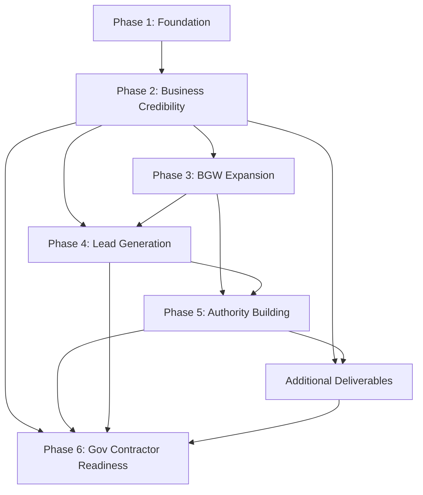

# FTBS + BGW Website Roadmap

**Project:** ftbs-website  
**Domain:** [ftbsllc.com](https://ftbsllc.com/)  
**Companies:** FTBS (Finesse Technology Business Solutions) · BGW Construction Company  
**Last updated:** June 2026

---

## Overview

This roadmap tracks the full lifecycle of the FTBS + BGW website from foundation through government-contractor readiness. Work is organized into six phases plus [cross-phase additional deliverables](./additional-deliverables.md).

### Current status

| Phase | Status | Summary |
|---|---|---|
| [Phase 1 — Foundation](./phase-1-foundation.md) | **In progress / largely complete** | Core pages, components, design system, basic SEO |
| [Phase 2 — Business Credibility](./phase-2-business-credibility.md) | Not started | Capability page, portfolio, case studies, testimonials, certifications |
| [Phase 3 — BGW Construction Expansion](./phase-3-bgw-construction-expansion.md) | Not started | BGW division, service verticals, project gallery |
| [Phase 4 — Lead Generation](./phase-4-lead-generation.md) | Not started | Consultation, quote, project inquiry forms + lead system |
| [Phase 5 — Authority Building](./phase-5-authority-building.md) | Not started | Blog, news, resource center, SEO strategy |
| [Phase 6 — Government Contractor Readiness](./phase-6-government-contractor-readiness.md) | Not started | Gov contracting page, PDF, NAICS, SAM, vendor info |
| [Additional Deliverables](./additional-deliverables.md) | Partial / planned | Careers, FAQ, legal pages, media kit |

---

## Business-critical deliverables by phase

### Phase 2 — Business Credibility

- Capability Statement Page
- Projects Portfolio
- Testimonials
- Case Studies
- Certifications Page

### Phase 3 — BGW Construction Expansion

- BGW Construction Division
- Infrastructure Services
- Commercial Construction
- Residential Construction
- Future Development
- Project Gallery

### Phase 4 — Lead Generation

- Consultation Form
- Quote Request Form
- Project Inquiry Form
- Lead Generation System

### Phase 5 — Authority Building

- Blog
- News
- Resource Center
- SEO Content Strategy

### Phase 6 — Government Contractor Readiness

- Government Contracting Page
- Capability Statement PDF Download
- NAICS Section
- SAM Registration Section
- Vendor Information Section

### Additional Deliverables (cross-phase)

- Careers Page · FAQ Page · Privacy Policy · Terms of Service · Cookie Policy · Media Kit  
→ See [additional-deliverables.md](./additional-deliverables.md)

---

## Recommended build order (master sequence)

Execute phases **sequentially** unless noted. Within each phase, follow the **implementation order** in that phase document.

```
PHASE 1 — Finish foundation + deploy
    │
    ▼
PHASE 2 — Credibility core (capability, portfolio, case studies, certifications, legal)
    │
    ├──► Additional: Privacy, Terms, FAQ (during Phase 2)
    │
    ▼
PHASE 3 — BGW division hub + service verticals + project gallery
    │
    ▼
PHASE 4 — Three dedicated forms + lead generation system
    │
    ▼
PHASE 5 — Blog, news, resource center, SEO strategy
    │         (+ Careers, Media Kit, FAQ expansion)
    │
    ▼
PHASE 6 — Government contracting, PDF, NAICS, SAM, vendor info
    │
    └──► Additional: Cookie policy (if not done in Phase 2)
```

### Master implementation order (top 30 items)

| # | Item | Phase |
|---|---|---|
| 1 | Complete Phase 1 QA + production deploy | 1 |
| 2 | Logo, phone, form email delivery | 2 |
| 3 | Capability Statement Page | 2 |
| 4 | Certifications Page | 2 |
| 5 | Projects Portfolio hub | 2 |
| 6 | Case Studies (3 minimum) | 2 |
| 7 | Testimonials | 2 |
| 8 | Privacy Policy + Terms of Service | 2 |
| 9 | FAQ Page (initial) | 2 |
| 10 | BGW Construction Division landing | 3 |
| 11 | Infrastructure Services page | 3 |
| 12 | Commercial Construction page | 3 |
| 13 | Residential Construction page | 3 |
| 14 | Project Gallery (BGW) | 3 |
| 15 | Future Development page | 3 |
| 16 | Lead Generation System (core routing) | 4 |
| 17 | Consultation Form | 4 |
| 18 | Quote Request Form | 4 |
| 19 | Project Inquiry Form | 4 |
| 20 | SEO Content Strategy document | 5 |
| 21 | Blog hub + founding articles | 5 |
| 22 | News section | 5 |
| 23 | Resource Center | 5 |
| 24 | Media Kit | 5 |
| 25 | Careers Page | 5 |
| 26 | Capability Statement PDF Download | 6 |
| 27 | Government Contracting Page | 6 |
| 28 | NAICS Section | 6 |
| 29 | SAM Registration Section | 6 |
| 30 | Vendor Information Section | 6 |

**Parallel opportunities**

- Legal copy (privacy, terms) can be drafted during Phase 1 deploy.
- Case study content gathering can start during Phase 1.
- SEO Content Strategy (Phase 5) can be drafted during Phase 3–4.
- SAM/NAICS inventory (Phase 6) can begin during Phase 2 certifications work.

---

## Cross-phase dependency map



| Dependency | Blocker | Unblocks |
|---|---|---|
| Phase 1 deploy | — | All public credibility work |
| Capability Statement Page (Phase 2) | Service copy, logo | Phase 6 PDF, gov page |
| Case Studies (Phase 2) | Photos, client approval | BGW gallery, gov past performance |
| BGW Division (Phase 3) | Phase 2 brand + letter | Service verticals, gallery |
| Lead Generation System (Phase 4) | Phase 2 email delivery | All dedicated forms |
| SEO Content Strategy (Phase 5) | Keyword research | Blog, news, resources |
| NAICS / SAM (Phase 6) | Verified registrations | Gov contracting page |

---

## Effort summary (updated)

| Phase | Estimated effort | Calendar (1 dev + content support) |
|---|---|---|
| Phase 1 | 3–4 weeks | Weeks 1–4 |
| Phase 2 | 4–5 weeks | Weeks 5–9 |
| Phase 3 | 3–4 weeks | Weeks 10–13 |
| Phase 4 | 3 weeks | Weeks 14–16 |
| Phase 5 | 5–8 weeks (ongoing) | Weeks 17–24+ |
| Phase 6 | 4–5 weeks | Weeks 22–27 (overlaps Phase 5) |
| Additional deliverables | 1–2 weeks (spread) | Phases 2 and 5 |

**Total to full gov-ready site:** approximately **6–7 months** with content and legal support.

---

## Business impact ranking (updated)

Ranked by effect on winning contracts, capturing leads, and institutional trust.

| Rank | Deliverable | Phase | Impact rationale |
|---|---|---|---|
| 1 | **Lead Generation System** | 4 | Converts all traffic into routed, measurable inquiries |
| 2 | **Capability Statement Page** | 2 | First thing procurement reviewers expect |
| 3 | **Case Studies** | 2 | Proof of execution for gov and institutional clients |
| 4 | **Project Inquiry Form** | 4 | Direct path for RFP and infrastructure partnerships |
| 5 | **BGW Construction Division** | 3 | Core differentiator and partnership narrative |
| 6 | **Form email delivery** (Phase 2 prerequisite) | 2 | Without delivery, no leads are captured |
| 7 | **Government Contracting Page** | 6 | Central hub for public sector audience |
| 8 | **Capability Statement PDF Download** | 6 | Required attachment for many solicitations |
| 9 | **Projects Portfolio** | 2 | Visual proof supporting all sales motions |
| 10 | **Infrastructure Services** (BGW) | 3 | Aligns site with stated mission and letter |
| 11 | **Quote Request Form** | 4 | Qualifies revenue opportunities |
| 12 | **Certifications Page** | 2 | Trust signal for licensed/registered work |
| 13 | **NAICS + SAM Registration Sections** | 6 | Required for federal discoverability |
| 14 | **Testimonials** | 2 | Social proof on home and portfolio |
| 15 | **Consultation Form** | 4 | Top-of-funnel relationship building |
| 16 | **Vendor Information Section** | 6 | Speeds vendor onboarding |
| 17 | **SEO Content Strategy** | 5 | Long-term organic lead growth |
| 18 | **Project Gallery** (BGW) | 3 | Visual credibility for BGW verticals |
| 19 | **Privacy Policy + Terms** | 2 | Required for compliant form collection |
| 20 | **Blog + Resource Center** | 5 | Authority and nurture over time |

---

## Quick wins (credibility in ≤1 week each)

| Quick win | Phase | Impact |
|---|---|---|
| Form email delivery | 2 | Critical — captures leads today |
| Phone number site-wide | 2 | High |
| Capability Statement Page (MVP) | 2 | Critical for procurement |
| First case study live | 2 | High |
| Privacy Policy + Terms | 2 | High |
| BGW Division landing (MVP) | 3 | High |
| Consultation Form | 4 | High |
| FAQ Page (8 questions) | 2 | Medium |

---

## Phase index

| # | Document | Focus |
|---|---|---|
| 1 | [phase-1-foundation.md](./phase-1-foundation.md) | Core site, components, SEO shell |
| 2 | [phase-2-business-credibility.md](./phase-2-business-credibility.md) | Capability, portfolio, case studies, certifications |
| 3 | [phase-3-bgw-construction-expansion.md](./phase-3-bgw-construction-expansion.md) | BGW division, verticals, gallery |
| 4 | [phase-4-lead-generation.md](./phase-4-lead-generation.md) | Forms + lead system |
| 5 | [phase-5-authority-building.md](./phase-5-authority-building.md) | Blog, news, resources, SEO |
| 6 | [phase-6-government-contractor-readiness.md](./phase-6-government-contractor-readiness.md) | Gov page, PDF, NAICS, SAM, vendor |
| — | [additional-deliverables.md](./additional-deliverables.md) | Careers, FAQ, legal, media kit |

---

## How to use this tracker

1. Open the phase document for the current sprint.
2. Check off tasks in the **Task checklist** as completed.
3. Verify **Completion criteria** before marking the phase done.
4. Confirm **Dependencies** are satisfied before starting blocked tasks.
5. Follow **Implementation order** within each phase.
6. Track [additional deliverables](./additional-deliverables.md) alongside their recommended phase.

---

## Content dependencies (client-provided)

Collect early — many phases depend on these:

- [ ] Official logo files (SVG, PNG)
- [ ] Brand color confirmation
- [ ] President full name and approved letter text
- [ ] Company phone number and confirmed email inbox
- [ ] 3+ project case studies with photos and client approval
- [ ] Testimonial quotes with permission
- [ ] Certification and license documentation
- [ ] Capability statement content
- [ ] NAICS codes and SAM/UEI registration details
- [ ] Vendor information (public-safe)
- [ ] Legal copy (privacy, terms, cookies)
- [ ] BGW service vertical copy and future development messaging
- [ ] Blog/news/resource content authors

---

## Related project docs

- Application README: [`../../README.md`](../../README.md)
- Agent rules: [`../../AGENTS.md`](../../AGENTS.md)
