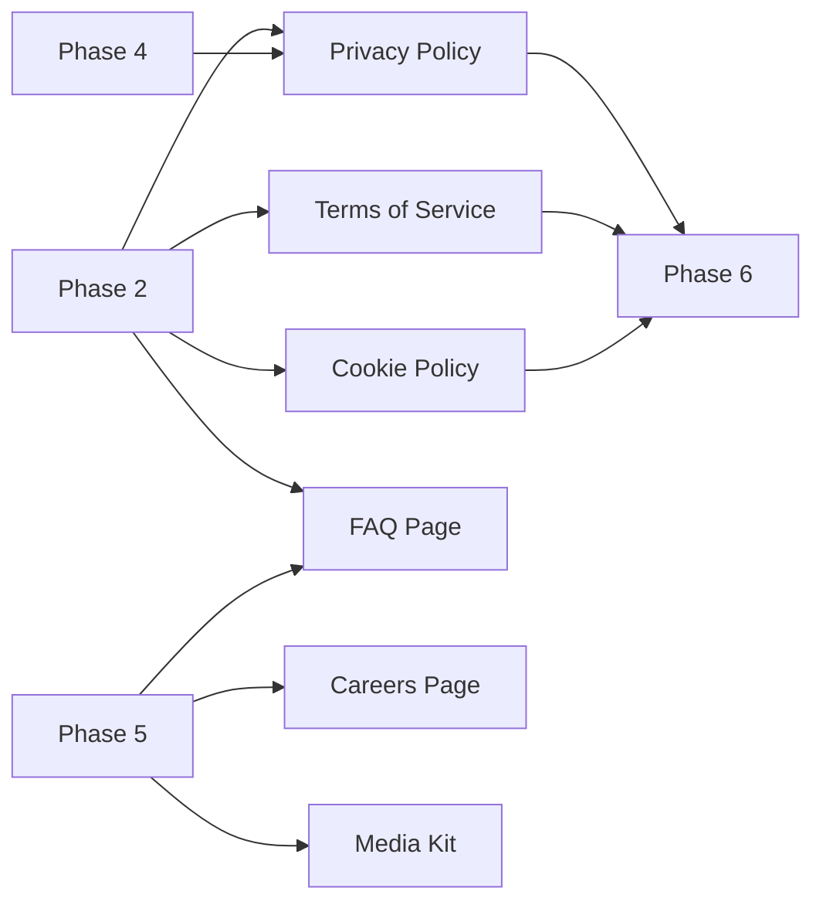

# Additional Deliverables

**Scope:** Cross-phase pages and assets that support credibility, compliance, recruiting, and media relations. These are not tied to a single phase but have recommended placement in the overall build order.

**Last updated:** June 2026

---

## Deliverable index

| Deliverable | Route (proposed) | Recommended phase | Priority |
|---|---|---|---|
| [Privacy Policy](#privacy-policy) | `/legal/privacy` | Phase 2 | Critical |
| [Terms of Service](#terms-of-service) | `/legal/terms` | Phase 2 | Critical |
| [Cookie Policy](#cookie-policy) | `/legal/cookies` | Phase 2 (when analytics live) | High |
| [FAQ Page](#faq-page) | `/faq` | Phase 2 (shell) · Phase 5 (expand) | High |
| [Careers Page](#careers-page) | `/careers` | Phase 5 | Medium |
| [Media Kit](#media-kit) | `/media` or `/media-kit` | Phase 5 | Medium |

---

## Privacy Policy

**Route:** `/legal/privacy`

**Purpose:** Required for form submissions, analytics, and government-facing credibility.

**Recommended phase:** Phase 2

**Task checklist**

- [ ] Draft privacy policy covering form data, email, and analytics
- [ ] Attorney or compliance review
- [ ] Publish page with clear, scannable sections
- [ ] Link in footer on all pages
- [ ] Reference from contact and lead forms
- [ ] Update when Phase 4 forms or Phase 5 analytics change data collection

**Depends on:** Legal copy from client/attorney  
**Blocks:** Phase 4 lead forms (full compliance), Phase 6 gov readiness

---

## Terms of Service

**Route:** `/legal/terms`

**Purpose:** Defines use of website and limits liability for public content.

**Recommended phase:** Phase 2

**Task checklist**

- [ ] Draft terms of service
- [ ] Legal review
- [ ] Publish and link in footer
- [ ] Cross-link from privacy policy

**Depends on:** Legal copy  
**Blocks:** Phase 6 gov readiness

---

## Cookie Policy

**Route:** `/legal/cookies`

**Purpose:** Discloses cookies and tracking; supports cookie consent if required.

**Recommended phase:** Phase 2 (publish when analytics added)

**Task checklist**

- [ ] Document cookies used (analytics, spam protection, etc.)
- [ ] Publish cookie policy page
- [ ] Link from privacy policy and footer
- [ ] Implement consent banner if required by jurisdiction
- [ ] Sync with Cookie Policy when tools change

**Depends on:** Analytics decision (Phase 2), privacy policy  
**Blocks:** Full EU/state compliance (if applicable)

---

## FAQ Page

**Route:** `/faq`

**Purpose:** Answers common questions from government, developers, and partners; supports SEO via FAQ schema.

**Recommended phase:** Phase 2 (initial 8–12 questions) · Phase 5 (expand + SEO)

**Task checklist**

- [ ] Define FAQ categories: Services, BGW, Contact, Government, General
- [ ] Publish initial FAQ page with accordion UI
- [ ] Add FAQPage JSON-LD
- [ ] Link from Services, Contact, and footer
- [ ] Expand with content from Phase 5 Resource Center
- [ ] Monthly review and updates

**Depends on:** Approved answers from FTBS/BGW leadership  
**Blocks:** Phase 5 SEO content (FAQ as landing support)

---

## Careers Page

**Route:** `/careers`

**Purpose:** Recruiting, company culture, open roles, and partnership in workforce growth.

**Recommended phase:** Phase 5

**Task checklist**

- [ ] Careers landing page with company mission tie-in
- [ ] Open positions section (or “No current openings” with inquiry form)
- [ ] Application or interest form (or mailto)
- [ ] Equal opportunity employer statement (if applicable)
- [ ] Link from footer and About page
- [ ] Optional: integration with hiring platform later

**Depends on:** HR/recruiting content, EEO copy  
**Blocks:** None critical

---

## Media Kit

**Route:** `/media` or `/media-kit`

**Purpose:** Press, partners, and procurement audiences — logos, boilerplate, leadership bios, photos.

**Recommended phase:** Phase 5

**Task checklist**

- [ ] Company boilerplate (short + long)
- [ ] Downloadable logo pack (SVG, PNG, light/dark)
- [ ] Leadership headshots and bios (approved)
- [ ] Brand colors and usage guidelines (brief)
- [ ] Press contact information
- [ ] Optional: downloadable fact sheet PDF

**Depends on:** Logo assets (Phase 2), leadership approval  
**Blocks:** External PR and partnership outreach efficiency

---

## Cross-deliverable dependency map

---

## Implementation order (additional deliverables)

1. **Privacy Policy** — Phase 2, before or with form email delivery  
2. **Terms of Service** — Phase 2, alongside privacy  
3. **FAQ Page** — Phase 2, initial questions from services and contact patterns  
4. **Cookie Policy** — Phase 2, when analytics or consent banner is enabled  
5. **Media Kit** — Phase 5, after logo and leadership assets finalized  
6. **Careers Page** — Phase 5, when recruiting content is ready  

---

## Completion criteria (additional deliverables)

All additional deliverables are **complete** when:

1. Each published page is linked from the footer or relevant hub.
2. Legal pages (privacy, terms, cookies) have been reviewed for accuracy.
3. FAQ page has FAQPage schema and at least 8 answered questions.
4. Media kit downloads work and assets match live site branding.
5. Careers page reflects current hiring status accurately.
