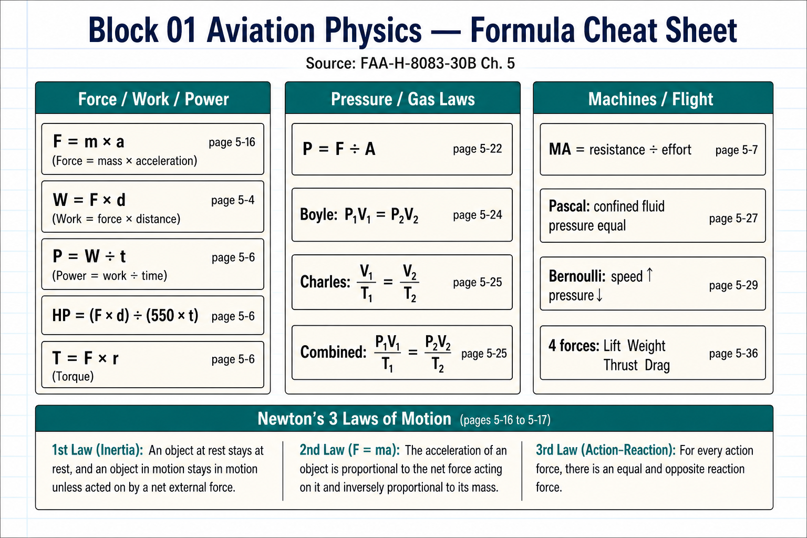
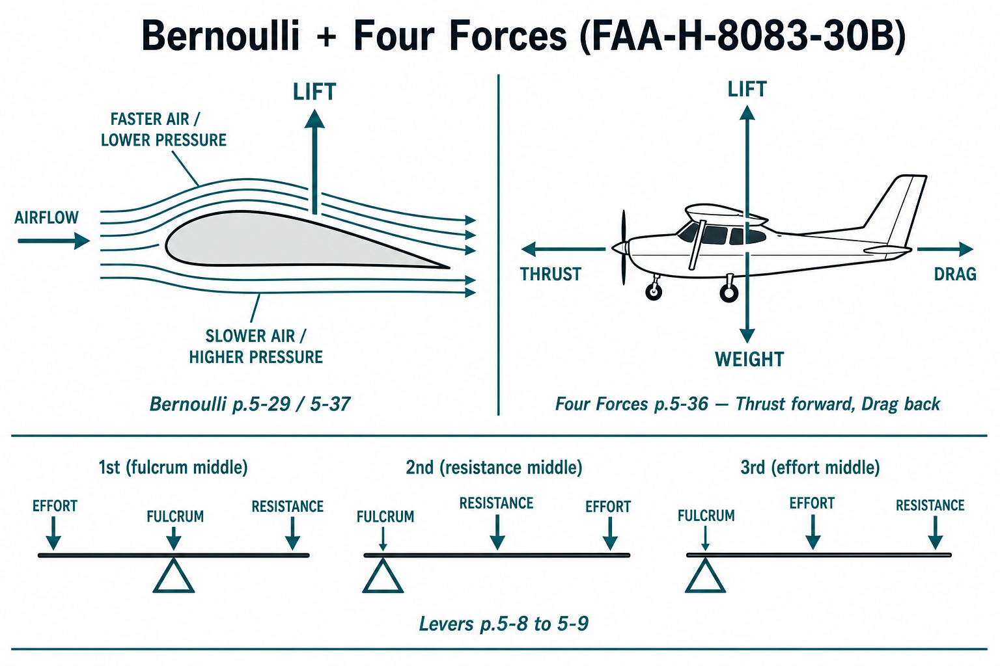

# Block 01 Aviation Physics — Notebook Notes

Copy the **cheat rows** and **definitions** into your notebook. Label each part of every formula when you work problems.

## Sources (where this came from)

| Source | What to use |
|--------|-------------|
| **FAA-H-8083-30B** *Aviation Maintenance Technician Handbook — General*, **Chapter 5: Physics for Aviation** | Main handbook pages below |
| **FAA ACS** Aviation Mechanic Certification Standards — **AM.I.J Physics for Aviation** | Test objectives (K1–K13, S1–S8) |
| Class file: **Block 01 Aviation Physics.pptx** | Match these notes to your instructor slides |

### FAA-H-8083-30B Chapter 5 — page map

| Topic | Handbook page |
|-------|----------------|
| Matter / density / specific gravity | **5-1** to **5-2** |
| Energy (PE / KE) | **5-2** to **5-3** |
| Force, work, friction | **5-4** to **5-5** |
| Power & torque | **5-6** |
| Simple machines / mechanical advantage | **5-7** |
| Levers | **5-8** to **5-9** |
| Pulley / gear / inclined plane | **5-9** to **5-11** |
| Stress & strain | **5-12** to **5-14** |
| Motion / speed / acceleration | **5-14** to **5-15** |
| Newton’s laws | **5-16** to **5-17** |
| Heat / heat transfer / temperature | **5-18** to **5-22** |
| Pressure (gauge / absolute / differential) | **5-22** to **5-23** |
| Gas laws (Boyle, Charles, general) | **5-23** to **5-25** |
| Pascal’s Law | **5-27** |
| Bernoulli’s Principle | **5-29** |
| Four forces / theory of flight / airfoils | **5-36** to **5-38** |

> Page numbers are **FAA-H-8083-30B** chapter pages (like `5-16`). If your printout is **8083-30A**, topics match but page numbers can be off by ~1.

### Study images

---

## 1) Matter & Density
**Ref: FAA-H-8083-30B pp. 5-1 to 5-2**

| Word | Meaning |
|------|---------|
| **Matter** | Anything that has mass and takes up space |
| **Mass** | Amount of matter (does not change with location) |
| **Weight** | Force of gravity on a mass (can change with location) |
| **Density** | Mass per unit volume |
| **Specific gravity** | Density of a substance compared to water (water = 1) |

**Formulas**
- Density = mass ÷ volume
- Specific gravity = density of substance ÷ density of water

**Cheat row**

| Idea | Formula | Labels |
|------|---------|--------|
| Density | D = m / V | **mass** / **volume** |
| Specific gravity | SG = D_substance / D_water | compare to water |

---

## 2) Energy
**Ref: FAA-H-8083-30B pp. 5-2 to 5-3**

| Type | Meaning | Example |
|------|---------|---------|
| **Potential (PE)** | Stored energy (position / condition) | Aircraft on jack stands; compressed spring |
| **Kinetic (KE)** | Energy of motion | Moving aircraft / spinning prop |

Energy can change form, but total energy is conserved (minus losses to heat/friction).

**Formulas (common forms)**
- PE = weight × height  (or mgh)
- KE = ½ × mass × velocity²

**Cheat row**

| Energy | Formula | Labels |
|--------|---------|--------|
| Potential | PE = W × h | **weight** × **height** |
| Kinetic | KE = ½ m v² | **mass**, **velocity** |

---

## 3) Force, Work, Power, Torque
**Ref: FAA-H-8083-30B pp. 5-4 to 5-6**

| Word | Meaning |
|------|---------|
| **Force** | A push or pull |
| **Work** | Force applied through a distance (same direction) |
| **Power** | How fast work is done (work ÷ time) |
| **Torque** | Twisting / rotational force |

**Formulas**
- Force: F = m × a  (Newton’s 2nd)
- Work: W = F × d
- Power: P = W ÷ t
- Horsepower (common AMT form): HP = (F × d) ÷ (550 × t)  
  (1 HP = 550 ft·lb/sec)
- Torque: Torque = Force × lever arm (radius)

**Cheat row**

| Idea | Formula | Labels |
|------|---------|--------|
| Force | F = m a | **mass** × **acceleration** |
| Work | W = F d | **force** × **distance** |
| Power | P = W / t | **work** ÷ **time** |
| Horsepower | HP = (F × d) / (550 × t) | force, distance, time |
| Torque | T = F × r | **force** × **radius/arm** |

---

## 4) Newton’s Laws (write these word-for-word)
**Ref: FAA-H-8083-30B pp. 5-16 to 5-17**

1. **1st (Inertia):** An object at rest stays at rest; an object in motion stays in motion in a straight line — unless an outside force acts.
2. **2nd (F = ma):** Force = mass × acceleration. More force → more accel; more mass → less accel for same force.
3. **3rd (Action/Reaction):** For every action there is an equal and opposite reaction.  
   Aircraft example: prop pushes air backward → air pushes aircraft forward (thrust).

**Motion labels**
- **Speed:** how fast
- **Velocity:** speed + direction
- **Acceleration:** change in velocity over time → a = (V₂ − V₁) / t

---

## 5) Simple Machines & Mechanical Advantage
**Ref: FAA-H-8083-30B pp. 5-7 to 5-11** (levers **5-8** to **5-9**)

Machines multiply force or change direction. They do **not** create energy.

**Mechanical advantage (MA)**
- MA = resistance force ÷ effort force  
  (or) MA = effort distance ÷ resistance distance

### Levers (label **effort**, **fulcrum**, **resistance**)

| Class | Order (left→right or arrangement) | Memory tip |
|-------|------------------------------------|------------|
| **1st** | Effort — Fulcrum — Resistance | Seesaw / crowbar; fulcrum in middle |
| **2nd** | Effort — Resistance — Fulcrum | Wheelbarrow; resistance in middle |
| **3rd** | Fulcrum — Effort — Resistance | Tweezers / landing gear retract; effort in middle |

Lever formula idea: Effort × effort arm = Resistance × resistance arm

### Gears (label **drive** / **driven**)

| Idea | Formula |
|------|---------|
| Gear ratio | teeth_driven ÷ teeth_drive |
| Speed vs torque | Bigger driven gear → slower speed, more torque |

Drive and driven gears turn **opposite** directions (external mesh).

### Pulley / inclined plane
- Fixed pulley: mainly changes direction (MA ≈ 1)
- Movable / block & tackle: MA ≈ number of supporting ropes
- Inclined plane MA ≈ length of slope ÷ height

**Cheat row**

| Machine | Formula / idea | Labels |
|---------|----------------|--------|
| MA | resistance ÷ effort | **resistance force**, **effort force** |
| Lever | E × EA = R × RA | **effort**, **effort arm**, **resistance**, **resistance arm** |
| Gears | GR = teeth_driven / teeth_drive | **drive**, **driven** |

---

## 6) Stress & Strain
**Ref: FAA-H-8083-30B pp. 5-12 to 5-14**

| Word | Meaning |
|------|---------|
| **Stress** | Internal force in a material from external load |
| **Strain** | How much the material deforms (changes shape/size) |

**5 stresses to memorize**

| Stress | What it does |
|--------|----------------|
| **Tension** | Pulls apart |
| **Compression** | Squeezes together |
| **Torsion** | Twists |
| **Shear** | Slides layers past each other |
| **Bending** | Combination (tension one side, compression other) |

---

## 7) Heat & Temperature
**Ref: FAA-H-8083-30B pp. 5-18 to 5-22**

| Word | Meaning |
|------|---------|
| **Heat** | Energy transfer because of temperature difference |
| **Temperature** | Measure of molecular motion / hotness |

**Heat moves 3 ways**
1. **Conduction** — through contact (metal)
2. **Convection** — by fluid movement (air/oil)
3. **Radiation** — through space/waves (sun, exhaust glow)

**Temp conversions (write both)**
- °F = (°C × 1.8) + 32
- °C = (°F − 32) ÷ 1.8
- Absolute: Kelvin / Rankine used with gas laws (no negative absolute temps)

**Cheat row**

| Convert | Formula |
|---------|---------|
| C → F | F = (C × 1.8) + 32 |
| F → C | C = (F − 32) / 1.8 |

---

## 8) Pressure
**Ref: FAA-H-8083-30B pp. 5-22 to 5-23**

**Pressure = Force ÷ Area**

| Type | Meaning |
|------|---------|
| **Absolute (psia)** | Pressure above a perfect vacuum |
| **Gauge (psig)** | Pressure above local atmosphere |
| **Differential** | Difference between two pressures |

Absolute ≈ Gauge + Atmospheric (≈ 14.7 psi at sea level)

**Cheat row**

| Idea | Formula | Labels |
|------|---------|--------|
| Pressure | P = F / A | **force** ÷ **area** |
| Absolute | P_abs ≈ P_gauge + 14.7 | gauge + atmosphere |

---

## 9) Gas Laws
**Ref: FAA-H-8083-30B pp. 5-23 to 5-25** (Boyle **5-24**, Charles **5-25**)

| Law | Rule (words) | Formula |
|-----|--------------|---------|
| **Boyle’s** | Temp constant: pressure ↑ volume ↓ | P₁V₁ = P₂V₂ |
| **Charles’** | Pressure constant: volume ↑ with absolute temp | V₁/T₁ = V₂/T₂ |
| **General / Combined** | P, V, T all related | (P₁V₁)/T₁ = (P₂V₂)/T₂ |

Always use **absolute temperature** with gas laws.

**Cheat row**

| Law | Holds constant | Formula |
|-----|----------------|---------|
| Boyle | Temperature | P₁V₁ = P₂V₂ |
| Charles | Pressure | V₁/T₁ = V₂/T₂ |
| Combined | — | P₁V₁/T₁ = P₂V₂/T₂ |

---

## 10) Fluids — Pascal & Bernoulli
**Ref: Pascal 5-27 · Bernoulli 5-29** (FAA-H-8083-30B)

**Pascal’s Law:** Pressure applied to a confined fluid is transmitted equally in all directions.  
Hydraulics: small force on small piston → large force on large piston (same pressure).

- P = F / A  (same P on both pistons)
- F₂ = P × A₂

**Bernoulli’s Principle:** In a flowing fluid, when **velocity increases**, **pressure decreases** (and vice versa).  
Venturi / wing: faster air over curved upper surface → lower pressure → **lift**.

**Cheat row**

| Principle | Memory line |
|-----------|-------------|
| Pascal | Confined fluid → pressure equal everywhere |
| Bernoulli | Speed up → pressure down |

---

## 11) Atmosphere & Performance (quick)
**Ref: FAA-H-8083-30B Ch. 5 (atmosphere / performance discussion near theory of flight)** + ACS AM.I.J.S2–S3

Standard day (sea level typical values to know):
- Pressure ≈ **29.92 inHg** / **14.7 psi**
- Temp ≈ **59 °F** / **15 °C**

| Term | Meaning |
|------|---------|
| **Pressure altitude** | Altitude from standard pressure setting |
| **Density altitude** | Pressure altitude corrected for nonstandard temperature |

Hot + high + humid → higher density altitude → **worse** performance (engine, prop, wing).

---

## 12) Theory of Flight (must-know)
**Ref: FAA-H-8083-30B pp. 5-36 to 5-38**

**Four forces**
- **Lift** up
- **Weight** down
- **Thrust** forward
- **Drag** backward

Straight-and-level unaccelerated: Lift = Weight, Thrust = Drag

**Airfoil labels**
- **Chord line** — leading edge to trailing edge straight line
- **Camber** — curve of the airfoil
- **Relative wind** — airflow opposite flight path
- **Angle of attack (AOA)** — angle between chord line and relative wind

Lift comes from:
1. Bernoulli (pressure difference), and
2. Newton’s 3rd (air deflected down → equal/opposite upward force)

**Primary flight controls:** aileron, elevator, rudder  
**Secondary:** flaps, trim, etc.

---

## Master Formula Cheat Sheet (one notebook page)

| # | Formula |
|---|---------|
| 1 | Density = m / V |
| 2 | F = m a |
| 3 | Work = F × d |
| 4 | Power = Work / t |
| 5 | HP = (F × d) / (550 × t) |
| 6 | Torque = F × r |
| 7 | P = F / A |
| 8 | MA = resistance / effort |
| 9 | Boyle: P₁V₁ = P₂V₂ |
| 10 | Charles: V₁/T₁ = V₂/T₂ |
| 11 | Combined: P₁V₁/T₁ = P₂V₂/T₂ |
| 12 | F = (C × 1.8) + 32 |
| 13 | C = (F − 32) / 1.8 |

---

## Stress / Law memory list (write once)

1. Tension – pull  
2. Compression – squeeze  
3. Torsion – twist  
4. Shear – slide  
5. Bending – mix  
6. Newton 1 – inertia  
7. Newton 2 – F=ma  
8. Newton 3 – action/reaction  
9. Pascal – pressure equal in confined fluid  
10. Bernoulli – faster flow, lower pressure  

_Last updated: 2026-07-22 — Block 01 Aviation Physics notebook summary with FAA-H-8083-30B page refs + study images_
